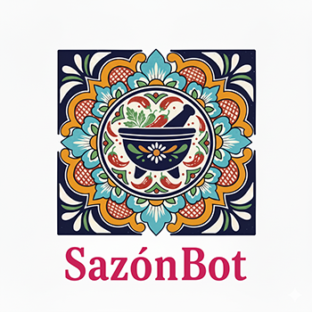

# 🌮 SazónBot - AI-Powered Mexican Recipe Chatbot

An intelligent conversational chatbot that shares authentic Mexican recipes from the García family collection. Built with LangChain agents, OpenAI GPT-4o-mini, and a warm, bilingual personality.



## ✨ Features

- **🤖 Intelligent Agent**: Powered by LangChain with 11+ specialized tools for recipe search, scaling, substitutions, and more
- **🌎 Bilingual Support**: Natural English/Spanish conversation with code-switching
- **🔍 Semantic Recipe Search**: Vector-based search using FAISS and OpenAI embeddings
- **📹 Rich Media**: Embedded YouTube cooking videos and food images
- **📏 Recipe Scaling**: Automatically adjust ingredients for any serving size
- **🔄 Ingredient Substitutions**: Smart alternatives for dietary restrictions and missing ingredients
- **📱 Responsive Design**: Beautiful mobile-first UI with smooth animations
- **💾 Session Memory**: Maintains conversation context per user
- **🎨 Mexican-Themed UI**: Custom color palette inspired by Mexican culture

## 🚀 Live Demo

**Frontend**: [https://sazonbot.vercel.app](https://sazonbot.vercel.app)  
**API**: [https://mexican-ai-chatbot.onrender.com/docs](https://mexican-ai-chatbot.onrender.com/docs)

> ⚠️ Note: First request may take 20-30 seconds on Render's free tier due to cold starts.

## 🛠️ Tech Stack

### Backend
- **Framework**: FastAPI (Python)
- **AI/ML**: LangChain, OpenAI GPT-4o-mini
- **Vector Store**: FAISS with OpenAI embeddings
- **Tools**: Google Serper API (web search), Pushover (notifications)
- **PDF Processing**: PyPDF for recipe extraction

### Frontend
- **Framework**: Next.js 15 (React 19)
- **Language**: TypeScript
- **Styling**: Tailwind CSS
- **HTTP Client**: Axios

## 📋 Prerequisites

- Python 3.11+
- Node.js 18+
- OpenAI API key
- Serper API key (optional, for web search)
- Pushover keys (optional, for feedback notifications)

## 🔧 Local Development Setup

### Backend Setup

1. **Clone the repository**
```bash
git clone https://github.com/yourusername/mexican-recipe-chatbot.git
cd mexican-recipe-chatbot/backend
```

2. **Create virtual environment (using uv)**
```bash
uv venv
source .venv/bin/activate  # On Windows: .venv\Scripts\activate
```

3. **Install dependencies**
```bash
uv pip install -r requirements.txt
```

4. **Create `.env` file**
```bash
cp .env.example .env
```

Add your API keys:
```env
OPENAI_API_KEY=sk-...
SERPER_API_KEY=...  # Optional
PUSHOVER_USER_KEY=...  # Optional
PUSHOVER_API_TOKEN=...  # Optional
```

5. **Create vector store**
```bash
python -m app.vector_store
# Choose option 1 to create new vector store
```

6. **Run the server**
```bash
python -m uvicorn app.main:app --reload
```

Backend will be available at `http://localhost:8000`

API docs at `http://localhost:8000/docs`

### Frontend Setup

1. **Navigate to frontend directory**
```bash
cd ../frontend
```

2. **Install dependencies**
```bash
npm install
```

3. **Create `.env.local` file**
```bash
echo "NEXT_PUBLIC_API_URL=http://localhost:8000" > .env.local
```

4. **Run development server**
```bash
npm run dev
```

Frontend will be available at `http://localhost:3000`

## 📁 Project Structure

```
mexican-recipe-chatbot/
├── backend/
│   ├── app/
│   │   ├── __init__.py
│   │   ├── agent.py           # LangChain agent with 11 tools
│   │   ├── config.py          # Environment configuration
│   │   ├── main.py            # FastAPI application
│   │   ├── models.py          # Pydantic models
│   │   ├── tools.py           # Agent tools (search, scale, etc.)
│   │   ├── vector_store.py    # FAISS vector store management
│   │   └── utils/
│   │       ├── recipe_parser.py    # Recipe scaling logic
│   │       └── safety.py           # Prompt injection protection
│   ├── data/
│   │   ├── recipes.pdf        # García family recipes
│   │   └── recipe_vectors/    # FAISS index (generated)
│   ├── requirements.txt
│   └── .env
├── frontend/
│   ├── pages/
│   │   ├── index.tsx          # Main chat interface
│   │   ├── _app.tsx
│   │   └── _document.tsx
│   ├── lib/
│   │   ├── api.ts             # API client
│   │   └── translations.ts    # i18n translations
│   ├── styles/
│   │   └── globals.css
│   ├── public/
│   │   └── logo.png
│   ├── package.json
│   └── .env.local
└── README.md
```

## 🔌 API Endpoints

### Health Check
```
GET /health
```

### Agent Chat
```
POST /agent-chat
Body: { "message": "How do I make pozole?" }
Response: { "response": "...", "sources_used": [...], "session_id": "..." }
```

### Clear Conversation
```
POST /agent-chat/clear/{session_id}
```

### Recipe Search
```
POST /search-recipes
Body: { "query": "chicken", "limit": 3 }
```

Full API documentation available at `/docs` when server is running.

## 🤖 Agent Tools

The chatbot uses 11 specialized tools:

1. **recipe_search_tool** - Semantic search in recipe database
2. **recipe_list_by_type_tool** - Browse recipes by category
3. **get_full_recipe_tool** - Get complete recipe details
4. **web_search_tool** - Search web for cooking information
5. **recipe_scale_tool** - Scale recipes for different servings
6. **ingredient_substitution_tool** - Find ingredient alternatives
7. **cooking_technique_tool** - Explain cooking methods
8. **recipe_filter_by_criteria_tool** - Complex recipe filtering
9. **video_search_tool** - Find YouTube cooking tutorials
10. **image_search_tool** - Find food images
11. **record_unknown_question_tool** - Log unanswered questions

## 🎨 Color Palette

The UI uses a Mexican-inspired color scheme:

- **Turkey Red** (`#a81007`) - Primary actions
- **Oxford Blue** (`#0d082d`) - Sidebar background
- **Fulvous** (`#dc8300`) - Accents and highlights
- **Cornsilk** (`#f9edcc`) - Message bubbles
- **Ghost White** (`#f8f4f9`) - Main background

## 🌐 Deployment

### Deploy Backend to Render

1. Create new Web Service on [Render](https://render.com)
2. Connect your GitHub repo
3. Configure:
   - Root Directory: `backend`
   - Build Command: `pip install -r requirements.txt`
   - Start Command: `uvicorn app.main:app --host 0.0.0.0 --port $PORT`
4. Add environment variables (API keys)
5. Deploy

### Deploy Frontend to Vercel

1. Import project on [Vercel](https://vercel.com)
2. Configure:
   - Root Directory: `frontend`
   - Framework: Next.js
3. Add environment variable:
   - `NEXT_PUBLIC_API_URL`: Your Render backend URL
4. Deploy

### Update CORS

After deployment, update `backend/app/main.py` CORS settings with your Vercel URL.

## 📝 Environment Variables

### Backend (.env)
```env
OPENAI_API_KEY=sk-...           # Required
SERPER_API_KEY=...              # Optional (for web search)
PUSHOVER_USER_KEY=...           # Optional (for feedback)
PUSHOVER_API_TOKEN=...          # Optional (for feedback)
```

### Frontend (.env.local)
```env
NEXT_PUBLIC_API_URL=http://localhost:8000  # Backend URL
```

## 🧪 Testing

### Test Backend
```bash
cd backend
python -m app.vector_store  # Option 2: Test vector store
python -m app.agent         # Test agent (uncomment test code)
```

### Test API Endpoints
Visit `http://localhost:8000/docs` for interactive API testing.

## 🚀 Performance Optimizations

- **Model**: GPT-4o-mini for 5-10x faster responses vs GPT-4
- **Streaming**: Real-time response streaming (ready for SSE implementation)
- **Caching**: Session-based memory for context retention
- **Vector Search**: FAISS for sub-second recipe lookups
- **Responsive UI**: Smooth animations and optimistic updates

## 🔒 Security Features

- Prompt injection protection
- Off-topic query filtering
- Session isolation per user
- CORS configuration
- Environment variable management

## 📚 Recipe Collection

The chatbot has access to authentic Mexican recipes including:
- Pozole Blanco
- Fajitas a la Vizcaína
- Tortitas de Atún
- And many more traditional dishes!

Recipes are stored in `backend/data/recipes.pdf` and processed into a vector database.

## 🤝 Contributing

Contributions are welcome! Please feel free to submit a Pull Request.

1. Fork the repository
2. Create your feature branch (`git checkout -b feature/AmazingFeature`)
3. Commit your changes (`git commit -m 'Add some AmazingFeature'`)
4. Push to the branch (`git push origin feature/AmazingFeature`)
5. Open a Pull Request

## 📄 License

This project is licensed under the MIT License - see the [LICENSE](LICENSE) file for details.

## 🙏 Acknowledgments

- García family for the authentic Mexican recipes
- OpenAI for GPT-4o-mini
- LangChain for the agent framework
- The open-source community

## 📧 Contact

Cristina Rodriguez - [LinkedIn](https://www.linkedin.com/in/crissrodriguez/)

Project Link: [https://github.com/Yosolita1978/mexican-ai-chatbot](https://github.com/Yosolita1978/mexican-ai-chatbot)

---

**¡Buen provecho!** 🌮🇲🇽